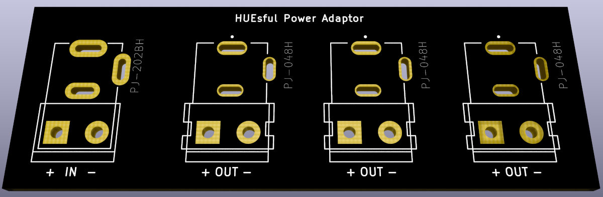

# HUEsful Power Adaptor

## Introduction

Sadly, the original power supply of Signify Philips Hue Playbars, Signe Table Lamps and more isn't particularly great.
They often have issues with a constant high-pitched whine and are overall very disappointing for the price tag.

You can't however simply replace it with a better 24V PSU, because Signify is using a gender-swapped borderline-proprietary connector for those.
Therefore, this project was born so that people have a better alternative than cutting open their power chords.

## Disclaimer

As always, you're using this at your own risk. It may void your warranty,
burn your house down or even leave hurtful comments on your latest social media posts.

You have been warned.

## Getting started

Check out the [releases section](https://github.com/Hypfer/huesful-power-adaptor/releases) for gerber files.

You can of course also download [KiCad](https://kicad-pcb.org/) (GPL V3) and plot those yourself.

## Specs

Signify is using a 6.5x3mm [CUI DEVICES PJ-048H DC Power Jack](https://www.cuidevices.com/product/resource/pj-048h.pdf) on their PSUs 
which is available via [DigiKey](https://www.digikey.de/product-detail/en/cui-devices/PJ-048H/CP-048H-ND/1644579) as well other suppliers.

There are three of those on this PCB. You don't have to populate all of them of course.

Furthermore, to connect a [proper PSU](https://www.amazon.de/-/en/LEICKE-Universal-Power-Supply-Plug/dp/B01GRYFNYK/), I've choosen the
[CUI DEVICES PJ-202BH DC Power Jack](https://www.cuidevices.com/product/resource/pj-202bh.pdf) which is a standard 5.5x2.5mm DC Power Jack
available via [DigiKey](https://www.digikey.com/en/products/detail/cui-devices/PJ-202BH/408451) as well as other suppliers.

You can also use a standard 5.08mm Terminal Block instead of one or more DC Power Jacks if you so desire.
That might be useful if you've already cut the power chord of your Hue Light in the past or want to daisy-chain multiple of these boards (not recommended).

## ToDo

A 3d printable case would be nice.

## License

This work is licensed under a
[Creative Commons Attribution-ShareAlike 4.0 International License][cc-by-sa].

[![CC BY-SA 4.0][cc-by-sa-image]][cc-by-sa]

[cc-by-sa]: http://creativecommons.org/licenses/by-sa/4.0/
[cc-by-sa-image]: ./img/cc-by-sa.png
